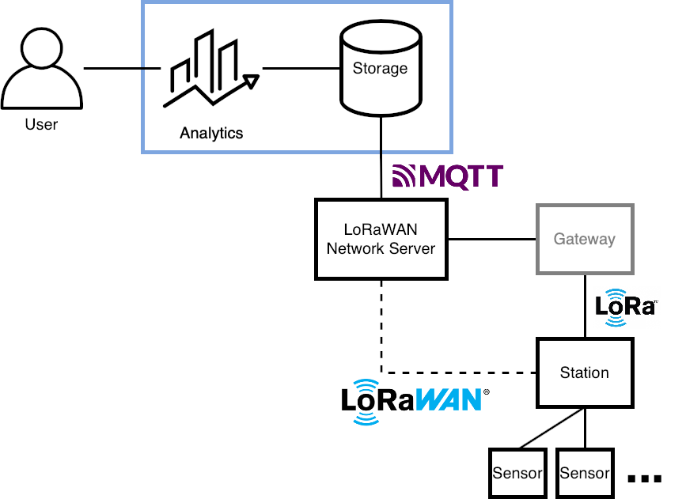

# Project8 - IoT Environmental Monitoring System Using LoRaWAN, MQTT and Node-RED
IITP Summer Program 2021 Project 8

## Team Members
- Hyemin Lim (Chung-Ang University)
- Sungho Lee (Chung-Ang University)
- Daniel Anselm (Purdue University)
- Gaeun Kim (Chung-Ang University)
- Juyeon Jung (Chung-Ang University)

## Project Goal
This project aims to build a environmental monitoring system that can be operated in large farmland using following technologies.

- LoRa and LoRaWAN - Enables secure, long-range data transmission that consumes low engergy.
- MQTT - Relays stream of data between a LoRaWAN network server and a Node-RED-based cloud platform.
- Node-RED - Provides easy-to-use environment to build flows to show data dashboard, database operation to store or retreive data.

The environmental monitoring station included in this project runs on a solar panel and a bettery to accomodate the large farmland setting where external power source is often unavailable.

## System Overview

- Sensors: measures environmental data
- Station: processes environmental data collected by the sensors and transmit the processed data to the server using LoRaWAN ([detail](./environmental_monitoring_station/README.md))
- Gateway: Relays LoRaWAN message from the station using its backhaul connection such as WiFi, ethernet, LTE, etc...
- LoRaWAN Network Server: manages LoRaWAN device connected to the network, decrypts LoRaWAN payload from the station and relays it to the cloud platform using MQTT
- Cloud Platform (blue box): Recieves environmental data and shows data on a dash board, stores data into a stotage, alerts the user if certain value goes over or under set threshold value ([detail](./user_interface/README.md))